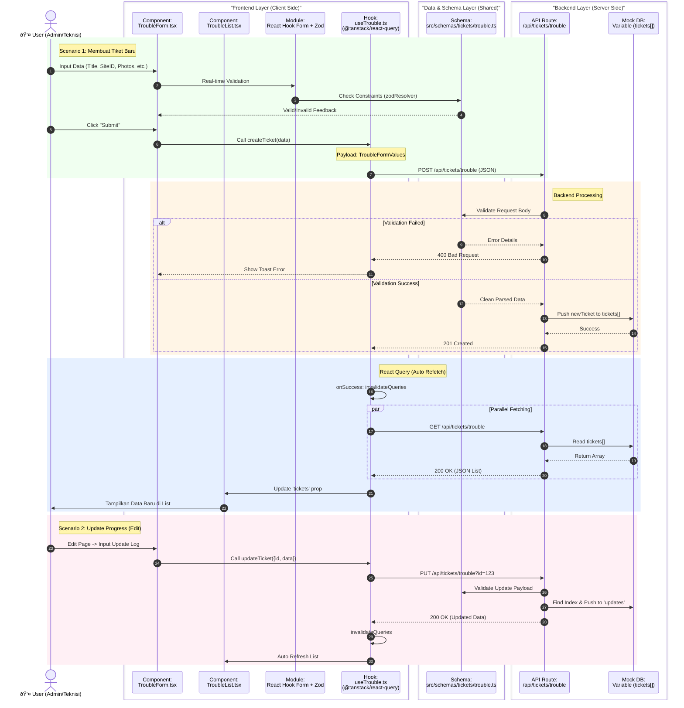

# Ticket Management Workflow

```mermaid
sequenceDiagram
    autonumber

    actor User as 👤 User (Admin/Teknisi)

    box "Frontend Layer (Client Side)" #f9f9f9
        participant FormUI as Component:<br/>TroubleForm.tsx
        participant ListUI as Component:<br/>TroubleList.tsx
        participant RHF as Module:<br/>React Hook Form + Zod
        participant Hook as Hook:<br/>useTrouble.ts<br/>(@tanstack/react-query)
    end

    box "Data & Schema Layer (Shared)" #e1f5fe
        participant Schema as Schema:<br/>src/schemas/tickets/trouble.ts
    end

    box "Backend Layer (Server Side)" #fff3e0
        participant API as API Route:<br/>/api/tickets/trouble
        participant DB as Mock DB:<br/>Variable (tickets[])
    end

    %% --- SCENARIO 1: CREATE NEW TICKET ---
    rect rgb(240, 255, 240)
        Note right of User: Scenario 1: Membuat Tiket Baru
        User->>FormUI: Input Data (Title, SiteID, Photos, etc.)
        FormUI->>RHF: Real-time Validation
        RHF->>Schema: Check Constraints (zodResolver)
        Schema-->>FormUI: Valid/Invalid Feedback
        User->>FormUI: Click "Submit"
        FormUI->>Hook: Call createTicket(data)
        Note over Hook: Payload: TroubleFormValues
        Hook->>API: POST /api/tickets/trouble (JSON)
    end

    %% --- SCENARIO 2: BACKEND PROCESSING ---
    rect rgb(255, 245, 230)
        Note right of API: Backend Processing
        API->>Schema: Validate Request Body
        alt Validation Failed
            Schema-->>API: Error Details
            API-->>Hook: 400 Bad Request
            Hook-->>FormUI: Show Toast Error
        else Validation Success
            Schema-->>API: Clean Parsed Data
            API->>DB: Push newTicket to tickets[]
            DB-->>API: Success
            API-->>Hook: 201 Created
        end
    end

    %% --- SCENARIO 3: REFETCH & UPDATE UI ---
    rect rgb(230, 240, 255)
        Note right of Hook: React Query (Auto Refetch)
        Hook->>Hook: onSuccess: invalidateQueries
        par Parallel Fetching
            Hook->>API: GET /api/tickets/trouble
            API->>DB: Read tickets[]
            DB-->>API: Return Array
            API-->>Hook: 200 OK (JSON List)
        end
        Hook->>ListUI: Update 'tickets' prop
        ListUI->>User: Tampilkan Data Baru di List
    end

    %% --- SCENARIO 4: UPDATE PROGRESS (PUT) ---
    rect rgb(255, 240, 245)
        Note right of User: Scenario 2: Update Progress (Edit)
        User->>FormUI: Edit Page -> Input Update Log
        FormUI->>Hook: Call updateTicket({id, data})
        Hook->>API: PUT /api/tickets/trouble?id=123
        API->>Schema: Validate Update Payload
        API->>DB: Find Index & Push to 'updates'
        API-->>Hook: 200 OK (Updated Data)
        Hook->>Hook: invalidateQueries
        Hook->>ListUI: Auto Refresh List
    end
```
